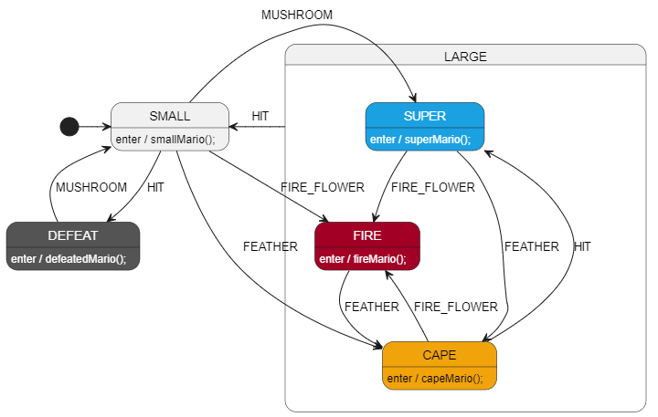

# Let's try it quick!
With the goal of keeping things as simple as possible to start, this tutorial uses `PlantUML` as the diagram tool, but StateSmith also supports `draw.io` (covered in other tutorials). PlantUML is a great place to start.

The first design we will look at is a small Hierarchical State Machine (HSM) that represents the state of Mario in a game.



As you complete the lessons in this tutorial, you'll be able to interact with the generated state machines in your web browser. One of the later lessons will be programming language specific.


<br>
<br>

# Download This Tutorial
You should download the full contents of this tutorial to your computer so that you can follow along with the examples and complete the exercises.


<br>
<br>

# Downloading the StateSmith CLI
StateSmith is written in cross platform C# and can be run on Windows, Linux, and macOS. I chose C# because I make heavy use of the open source Roslyn compiler to transpile the generated state machine code into C99/C++, CSharp, JavaScript...

There are two main ways to run the StateSmith CLI:
1. Download the pre-built binary for your computer (no need for dotnet).
2. Install the StateSmith CLI using the dotnet SDK.

## If you already have a dotnet SDK installed
If you already have a dotnet SDK (6,7,8) installed, you can quickly install the StateSmith CLI using the following command. It is the smallest (28 MB), fastest, and simplest way to install the StateSmith CLI.

```sh
dotnet tool install --global StateSmith.Cli
```
Make sure that the StateSmith.Cli version is at least `0.10.0`. I generally recommend using the latest release available. You can check the version by running:

```sh
ss.cli --version
```

You can now skip to the next section (past downloading).


<br>

## Download the standalone binary (no dotnet required)
🔥 Please note that the standalone binaries are new. I've only been able to test on a few architectures [noted here](https://github.com/StateSmith/StateSmith/wiki/Binary-Files#platform-testing). Your help testing would be appreciated.

If you run into any issues, please consider installing the StateSmith CLI using a dotnet SDK as described in the previous section. It has worked well for many users so far and is indirectly supported by Microsoft.

Release files: [https://github.com/StateSmith/StateSmith/releases](https://github.com/StateSmith/StateSmith/releases)

### Windows
1. Download binary from [releases page](https://github.com/StateSmith/StateSmith/releases). If unsure, use [windows-x64-compressed](https://github.com/StateSmith/StateSmith/releases/download/cli-v0.14.0/ss.cli-win-x64-compressed.exe).
2. Put the binary in this directory.
3. Rename the downloaded binary to `ss.cli.exe`.

### Linux
The below instructions assume Linux x64 (non-Alpine). Alpine and `ARM` binaries also [available](https://github.com/StateSmith/StateSmith/releases).

```sh
# download the 60 MB binary
wget https://github.com/StateSmith/StateSmith/releases/download/cli-v0.14.0/ss.cli-linux-x64-compressed

# rename the binary so that following instructions are cross platform
mv ss.cli-linux-x64-compressed ss.cli

# make binary executable
chmod +x ss.cli

# optional: move the binary to a location in your PATH
# If you choose not to do this, you will need to run the binary with `./ss.cli`
sudo mv ss.cli /usr/local/bin
```

### Mac
🔥 We only have a bit of testing on macOS right now. It looks like `arm64` is not working, but you can use `x64` even on new arm based macs. See [comment here](https://github.com/StateSmith/StateSmith/issues/260#issuecomment-2210249795).


```sh
# download the 60 MB binary
wget https://github.com/StateSmith/StateSmith/releases/download/cli-v0.14.0/ss.cli-osx-x64-compressed

# rename the binary so that following instructions are cross platform
mv ss.cli-osx-x64-compressed ss.cli

# make binary executable
chmod +x ss.cli

# optional: move the binary to a location in your PATH
# If you choose not to do this, you will need to run the binary with `./ss.cli`
sudo mv ss.cli /usr/local/bin
```


<br>

# Quick Test of the StateSmith CLI
Let's test the StateSmith CLI to make sure it is working. Run the following command in your terminal:

```sh
ss.cli --version
```
You should see output similar to the following:

```
Using settings directory: /home/afk/.config/StateSmith.Cli
StateSmith.Cli 0.10.0+4a4e30018e9a371124530fa96cf2ba3322b80459
```

Make sure the version is at least `0.10.0`.

<br>

Now let's see what commands are available:

```sh
ss.cli --help
```

You should see output similar to the following:

```
Usage:

  run       Run StateSmith code generation.

  create    Create a new StateSmith project from template.
  
  setup     Set up vscode for StateSmith & csx files.

To get help for a specific verb, use the command name followed by --help
```

<br>

Now let's see what commands are available for the `run` verb:

```sh
ss.cli run --help
```

You should see output similar to the following:

```
  -h, --here         Runs code generation in this directory.

  -b, --rebuild      Ensures code generation is run. Ignores change detection.

  -u, --up           Searches upwards for manifest file.

  -r, --recursive    Recursive. Can't use with -i.

  -x, --exclude      Glob patterns to exclude

  -i, --include      Glob patterns to include. ex: `**/src/*.csx`. Can't use
                     with -r.
<snip...>
```

<br>


# Onwards! ⏭️
Navigate to [lesson-1](./lesson-1/README.md) and see the readme there.
