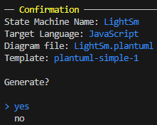

# Let's Create A Brand New State Machine
In this lesson, we will create a new state machine from scratch that controls a laser flashlight.

You can see it in action by opening `index.html` in a web browser.


## Delete Existing `LightSm.*` Files
Our goal is to create a new state machine from scratch so go ahead and delete the existing `LightSm.*` files in this directory.


## Create A New PlantUML File
We can do this manually, or `ss.cli` can help us by generating a new diagram from template for us.

Let's use `ss.cli`. Run the following command in the terminal:

```bash
ss.cli
```

Use the arrow keys to select `Create` and hit enter.<br>


Select `User Friendly` and hit enter.<br>


Type in the name of the state machine `LightSm` and hit enter.<br>


Select `JavaScript` and hit enter.<br>


Select `PlantUML` and hit enter.<br>


Take the default suggestion for diagram name/path by hitting enter.<br>


Select the minimal (or any) template and hit enter.<br>


Select `yes` to confirm and hit enter.<br>


You should now see a `LightSm.plantuml` file in this directory.

## Open The PlantUML File
Open the `LightSm.plantuml` file in your editor of choice and you'll see a sample state machine template.

Replace the contents of the file with the following:

```plantuml
@startuml LightSm

'//////////////////// STATE ORGANIZATION ////////////////////
' Note: StateSmith treats state names and events as case insensitive.
' More info: https://github.com/StateSmith/StateSmith/wiki/PlantUML

[*] -> OFF

state ON_GROUP {
    [*] -> ON1
    state ON1
    state ON2
}

'//////////////////// STATE HANDLERS ////////////////////

'OFF
OFF: enter / print("OFF entered");
OFF --> ON1 : inc

'ON_GROUP
ON_GROUP --> OFF: turn_off

'ON1
ON1: enter / print("ON1 entered");
ON1 --> ON2 : inc
ON1 --> OFF : dim

'ON2
ON2: enter / print("ON2 entered");
ON2 --> ON1 : dim

'######################## StateSmith config ########################
/'! $CONFIG : toml
[SmRunnerSettings]
transpilerId = "JavaScript"

[SmRunnerSettings.simulation]
enableGeneration = false
'/
@enduml
```

# Generate The State Machine Code
Run the below command in this (`lesson-2`) directory to run StateSmith on the diagram file.
```
ss.cli run --here
```

<br>

# Interact With The State Machine 🌍
Now that we've generated the state machine JavaScript code, let's interact with it.
Open `index.html` with a web browser.
