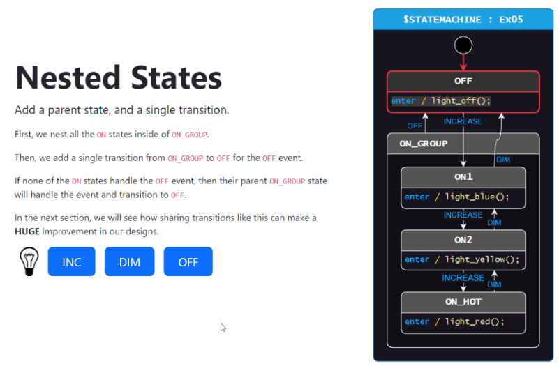

# Install Required Tools 📦
## Step 1
Install `dotnet` [version 6 or greater](https://dotnet.microsoft.com/en-us/download/dotnet/sdk-for-vs-code). I recommend a Long Term Support (LTS) version like 8.0.

## Step 2
Then install `dotnet-script` with the following command in a command prompt/terminal:
```
dotnet tool install --global dotnet-script
```

> We will eventually remove the need for `dotnet-script` in the future, but for now it is required.

## Step 3
Then install `StateSmith.CLI` with the following command in a command prompt/terminal:
```
dotnet tool install --global StateSmith.CLI
```

MAKE SURE that you have version 0.9.3 or greater of `StateSmith.CLI` installed. The version is printed every time you run `ss.cli`:
```
> ss.cli       
StateSmith.Cli 0.9.3+5a3201baf3c69d5930b1b6277c6dfc2a4a700564
```

If you are using an older version, you can update it with the following command:
```
dotnet tool update --global StateSmith.CLI
```

More info on `StateSmith.CLI` can be found at the project page [here](https://github.com/StateSmith/StateSmith/blob/main/src/StateSmith.Cli/README.md).

## Optional Step 4
If you are using vscode, you can install the `PlantUML` extension to get syntax highlighting for `.plantuml` files as well as preview diagrams.

<br>

# Download tutorial-3
You should download the full contents of `tutorial-3` to your computer.

> Hint: you might find it helpful to open vscode in the current lesson's directory (instead of the root `tutorial-3` directory). You can do this with `Menu -> File -> Open Folder...` and selecting the lesson directory you want to work on.

<br>

# Interactive Online Examples
The below link is super helpful to quickly see the basics of what StateSmith can offer. It has a bunch of interactive web examples and allows you to see StateSmith features in action.

https://statesmith.github.io/fundamentals-1/

[   ](https://statesmith.github.io/fundamentals-1/)


<br>

# Onwards!
⏭️ See [lesson-1 README](../lesson-1/README.md).
