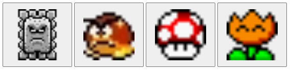

# Prerequisite
Be able to run `ss.cli` as explained in the main [../README.md](../README.md) file.

<br>

# Where is my preferred programming language?
Don't worry, there is a language specific example in a later lesson.

All the **non**-language specific examples will use html/javascript because everyone has a browser that can run them.


<br>

# Code Generation
In this directory (`lesson-0`) run the following command to run StateSmith <u>h</u>ere (in this directory).

```sh
ss.cli run -h
```

If you don't have the `ss.cli` binary in your PATH, you will need to run the following command instead to access the ss.cli binary in the tutorial root directory:

```sh
../ss.cli run -h
```

You should see output similar to the following:

```
<snip>

StateSmith Runner - Compiling file: `MarioSm.plantuml` (no state machine name specified).
StateSmith Runner - State machine `MarioSm` selected.
StateSmith Runner - Writing to file `MarioSm.js`
StateSmith Runner - Writing to file `MarioSm.sim.html`
StateSmith Runner - Finished normally.

<snip>
```

This output indicates that the StateSmith CLI has successfully generated the code for the `MarioSm` state machine.


<br>

# Interact With The State Machine
Open `index.html` in your web browser and press buttons to send events to the state machine.



<br>

# StateSmith Runs Your Exact Code
By default, StateSmith outputs the **exact same action code** you put in your diagram. In this case, it is calling global functions (written by the user), but we'll also cover other ways for your state machine to interact with the outside world.


```javascript
// global user written function called by the state machine
function fireMario() {
    marioImg.src = "img/fire-mario-dance.gif"
}
```

<br>


# PlantUML Diagram
You can learn more about PlantUML state machines at [https://plantuml.com/state-diagram](https://plantuml.com/state-diagram), but we will cover the basics here. It is very simple.

Check out the file [MarioSm.plantuml](./MarioSm.plantuml) to see the diagram that defines the state machine. It is well commented and easy to understand.

You can define a diagram a number of ways using PlantUML. Here's one simple example. First layout your states:

```plantuml
state SMALL

' The DEFEAT state has an optional <<dark>> style.
state DEFEAT <<dark>>

' The LARGE state is a super state (AKA composite state) with substates
state LARGE {
    state SUPER <<blue>>
    state FIRE  <<red>>
    state CAPE  <<gold>>
}
```

Then add your state behaviors (transitions/code):

```plantuml
' Define the initial transition that is taken when the state machine starts.
[*] -> SMALL

SMALL: enter / smallMario();
SMALL --> SUPER: MUSHROOM
SMALL --> FIRE: FIRE_FLOWER
SMALL --> CAPE: FEATHER
SMALL --> DEFEAT: HIT
```

## Pro PlantUML Tip
If you are new to PlantUML, you can use the [PlantUML online editor](https://www.plantuml.com/plantuml/uml/SoWkIImgAStDuOhMYbNGjLC8zdNqyU42amgwGBwFOv2xAvT3QbuAK140). It is a great way to learn PlantUML and see your diagrams in real time.

I would also highly recommend the [PlantUML extension for vscode](https://marketplace.visualstudio.com/items?itemName=jebbs.plantuml). It is a great way to see your diagrams in vscode and get syntax highlighting. You can see a graphical representation of the diagram by opening the plantuml file in vscode and pressing `Alt + D` or clicking the `Preview` button in the top right corner of the editor.


This is really handy because you can see the graphical diagram update live as you edit the file. It also checks for syntax errors and will show you where they are.


<br>


# What About StateSmith Commands In PlantUML File?
The bottom of the `.plantuml` file contains a special comment block that can be used to configure StateSmith settings. This is where you can specify the transpiler to use, and other settings.

```plantuml
/'! $CONFIG : toml
[SmRunnerSettings]
transpilerId = "JavaScript"
'/
```

More settings are available here: https://github.com/StateSmith/StateSmith/issues/335

<br>

# Edit The Diagram
Try modifying the diagram in the `.plantuml` file by changing some of the transitions.

For example, make Mario start as Super Mario (instead of small) when he is revived with a mushroom.

After you've made your changes, run the `ss.cli` command again to see the changes in the generated code.

```
ss.cli run --here
```

Then refresh the `index.html` page in your browser to see the changes in action.


<br>

# Check Out The Simulator
Open `MarioSm.sim.html` in your browser to see the state machine simulator.

The simulator is a tool that allows you to interact with the state machine and see the state machine's behavior. Very useful for understanding a state machine's behavior.

Note the following limitations of this early simulator:
* No user action code is run in the simulator. It simply notes the user action code that would have run.
* The simulator requires users to evaluate guard conditions manually.
* The simulator uses a 3rd party library (mermaid.js) to render the state machine. This library has limitations and doesn't render all state machine features correctly. However, the actual state machine will function correctly. See mermaid related bugs [here](https://github.com/StateSmith/StateSmith/issues?q=is%3Aissue+is%3Aopen+mermaid+label%3Abug).
* It will improve over time. PRs welcome!


<br>


# Onwards!
⏭️ Next we are going to quickly generate a new state machine using the StateSmith CLI.
<!-- ⏭️ Head over to [lesson 2 README.md](../lesson-2/README.md). -->


# FIXME ----------------
Move below stuff...


# Onwards!
⏭️ Language specific section


...

# Congratulations! 🎉
You now know how to create a state machine using PlantUML and StateSmith.

Here's some next steps if you are interested in learning more:
* fundamentals page
* draw.io - great for large designs
* examples
* youtube channel

