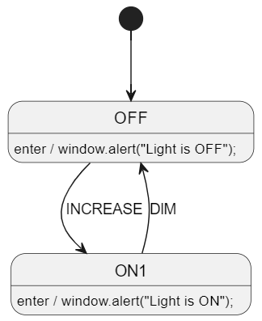
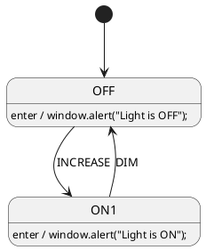
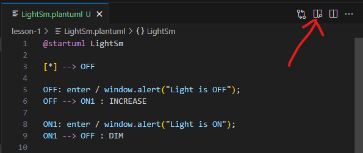
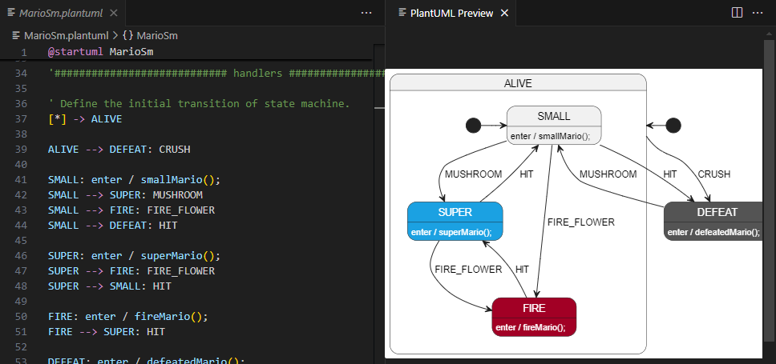
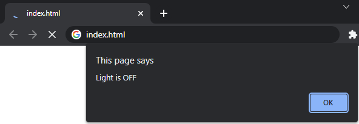
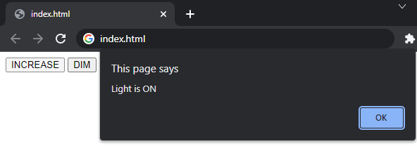

# Compile a State Machine Diagram and Run It
In this lesson, we will:
* Run StateSmith on a PlantUML state machine diagram file
* Generate JavaScript code from the diagram
* Interact with the generated state machine in a web browser


<br>

# Where is my preferred programming language?
Don't worry, there is a language specific example in a later lesson.

All the **non**-language specific examples will use html/javascript because everyone has a browser that can run them.


# PlantUML Diagram
You can learn more about PlantUML state machines at [https://plantuml.com/state-diagram](https://plantuml.com/state-diagram), but we will cover the basics here. It is very simple.

Here's the diagram we will be using for this lesson. It is a simple light switch state machine.



* The state machine starts in the `OFF` state.
* When the `INCREASE` event is dispatched, the state changes to `ON1`.
* When the `DIM` event is dispatched, the state changes back to `OFF`.
* When either state is entered, an alert dialog is shown with the state name.

We specify our state machine in the `LightSm.plantuml` file like this:



If you have the vscode PlantUML extension installed, you can see a graphical representation of the diagram by opening the [LightSm.plantuml](./LightSm.plantuml) file in vscode and pressing `Alt + D` or clicking the `Preview` button in the top right corner of the editor.



This can be really handy because you can see the graphical diagram as you edit the file. It also checks for syntax errors and will show you where they are.



<br>

# Generate The State Machine Code
Run the below command in this (`lesson-1`) directory to run StateSmith on the diagram file.
```
ss.cli run --here
```
You should see output like the following:
```
── Checking diagram: `LightSm.plantuml` ─────────
Diagram settings: Lang: NotYetSet, NoSimGen: False
Change detection not implemented yet. Rebuild for diagram. Issue #328.
Running diagram: `LightSm.plantuml`

StateSmith Runner - Compiling file: `LightSm.plantuml` (no state machine name specified).
StateSmith Runner - State machine `LightSm` selected.
StateSmith Runner - Writing to file `LightSm.js`
StateSmith Runner - Finished normally.
```


<br>

# Interact With The State Machine 🌍
Now that we've generated the state machine JavaScript code, let's interact with it.
Open `index.html` with a web browser. You will get an alert dialog box saying "Light is OFF".



Close the alert dialog and press the `INCREASE` button. You'll get a message saying "Light is ON".



These are the exact strings we defined in our state machine diagram.


<br>

# StateSmith Runs Your Exact Code
By default, StateSmith outputs the **exact same action code** you put in your diagram. In a later section we will cover different ways to keep your designs concise and readable.


<br>

# What Happened In The Example?
The example `index.html` file is very simple. It creates a state machine, starts it, then dispatches events to it when a button is pressed.

```html
<html>
    <script src="LightSm.js"></script> <!-- generated state machine file -->
    <script>
        let stateMachine = new LightSm();
        stateMachine.start();
    </script>
    <body>
        <button onclick="stateMachine.dispatchEvent(LightSm.EventId.INCREASE)">INCREASE</button>
        <button onclick="stateMachine.dispatchEvent(LightSm.EventId.DIM)">DIM</button>
    </body>
</html>
```


<br>

# What About StateSmith Commands In PlantUML File?
The bottom of the `LightSm.plantuml` file contains a special comment block that can be used to configure StateSmith settings. This is where you can specify the transpiler to use, and other settings.

In this particular example, we specified that we wanted:
* the JavaScript transpiler to be used
* no simulation html file to be generated (we will cover that in a later lesson)

```plantuml
/'! $CONFIG : toml
[SmRunnerSettings]
transpilerId = "JavaScript"

[SmRunnerSettings.simulation]
enableGeneration = false
'/
```

<br>

# Let's Edit The Diagram!
Try modifying the diagram in the `LightSm.plantuml` file. For example, you could add a new state, or change the action code in the existing states.

After you've made your changes, run the `ss.cli` command again to see the changes in the generated code.

```
ss.cli run --here
```

Then refresh the `index.html` page in your browser to see the changes in action.

<br>

# Onwards!
⏭️ Head over to [lesson 2 README.md](../lesson-2/README.md).
