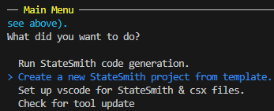
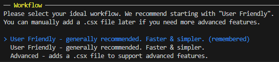
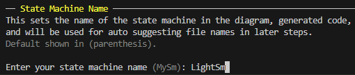
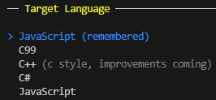
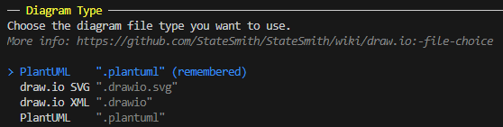
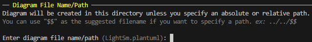
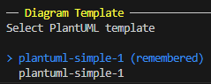
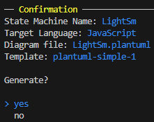
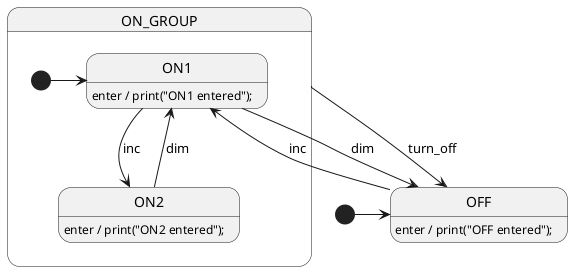

# Let's Create A Brand New State Machine
In this lesson, we will create a new state machine from scratch.

## Create A New PlantUML File
We can do this manually, or `ss.cli` can help us by generating a new diagram from template for us.

Let's use `ss.cli`. Run the following command in the terminal:

```bash
ss.cli
```

Use the arrow keys to select `Create` and hit enter.<br>


Select `User Friendly` and hit enter.<br>


Type in the name of the state machine `LightSm` and hit enter.<br>


Select `JavaScript` and hit enter.<br>


Select `PlantUML` and hit enter.<br>


Take the default suggestion for diagram name/path by hitting enter.<br>


Select simple template and hit enter.<br>


Select `yes` to confirm and hit enter.<br>


You should now see a `LightSm.plantuml` file in this directory.

## Open The PlantUML File
Open the `LightSm.plantuml` file in your editor of choice and you'll see a sample state machine template.

Replace the contents of the file with the following:



# Generate The State Machine Code
Run the below command in this (`lesson-2`) directory to run StateSmith on the diagram file.
```
ss.cli run --here
```

<br>

# Interact With The State Machine 🌍
Now that we've generated the state machine JavaScript code, let's interact with it.
Open `index.html` with a web browser.
