# Let's Create A Brand New State Machine
In this lesson, we will create a new state machine from scratch that controls a laser flashlight.

You can see it in action by opening `index.html` in a web browser.


## Delete Existing `LightSm.*` Files
Our goal is to create a new state machine from scratch so go ahead and delete the existing `LightSm.*` files in this directory.


## Create A New PlantUML File
We can do this manually, or `ss.cli` can help us by generating a new diagram from template for us.

Let's use `ss.cli`. Run the following command in the terminal:

```bash
ss.cli
```

Use the arrow keys to select `Create` and hit enter.<br>
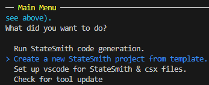

Select `User Friendly` and hit enter.<br>
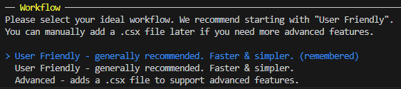

Type in the name of the state machine `LightSm` and hit enter.<br>
📢 NOTE! It must be exactly `LightSm` for the rest of this lesson to work.<br>
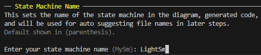

Select `JavaScript` and hit enter.<br>
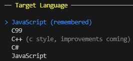

Select `PlantUML` and hit enter.<br>
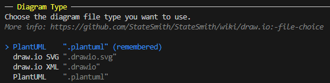

Take the default suggestion for diagram name/path by hitting enter.<br>
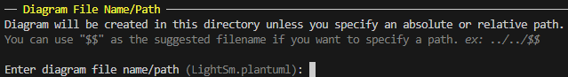

Select the minimal (or any) template and hit enter.<br>
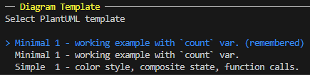

Select `yes` to confirm and hit enter.<br>
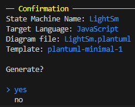

You should now see a `LightSm.plantuml` file in this directory.

## Open The PlantUML File
Open the `LightSm.plantuml` file in your editor of choice and you'll see a sample state machine template.

Replace the contents of the file with the following:

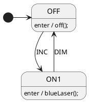

We now have a state machine with two states `OFF` and `ON1`. The `OFF` state is the initial state and the `ON1` state is the state when the laser flashlight is on.

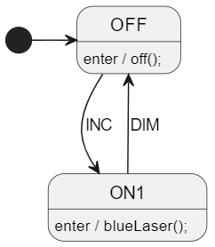

# Generate The State Machine Code
Run the below command in this directory to generate code from your diagram file.
```
ss.cli run --here
```

## Interact With The State Machine 🌍
Now that we've generated the state machine JavaScript code, let's interact with it.
Open `index.html` with a web browser. You may need to refresh the page in your browser to see the changes.

You should now be able to use the `INC` and `DIM` buttons to control the laser flashlight.


<br>
<br>


# Add Another State `ON2`
Add another state `ON2` to the PlantUML file with the following behavior:
* upon entering the state, it should call the function `yellowLaser()`
* it should transition to `ON1` when the `DIM` event is received

Additionally, add a transition from `ON1` to `ON2` when the `INC` event is received.

We need to add four additional lines to the PlantUML file. See if you can do it yourself. If you get stuck, you can find the solution below.

 *scroll down* ▼ <br>
 <br>
 <br>
 <br>
 <br>
 *scroll down* ▼ <br>
 <br>
 <br>
 <br>
 <br>
 *scroll down* ▼ <br>
 <br>
 <br>
 <br>
 <br>
 *scroll down* ▼ <br>
 <br>
 <br>
 <br>
 <br>
 
When you are finished, your PlantUML graphical diagram should look like this:

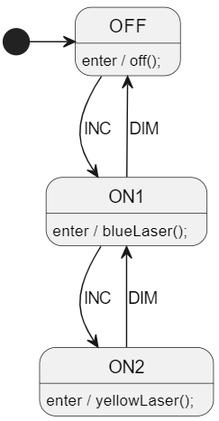

and your PlantUML text file should now look something like this:

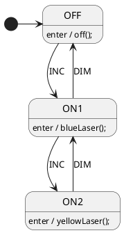

Generate your state machine code using `ss.cli` and open `index.html` in a web browser to interact with the state machine. You may need to refresh the page in your browser to see the changes.


<br>
<br>

# Add A Variable And Guard Condition
We have one more laser color to add to our flashlight: `redLaser()`.

To get to the red laser `ON3` state, we want the user to have to press the `INC` button three times while in the `ON2` state.

There's a number of ways to implement this. We could use a global count variable, but we will use a variable that belongs to the state machine instance instead.

### Add The `ON3` State
Add the `ON3` state to the PlantUML file.

```diff
 state OFF
 state ON1
 state ON2
+state ON3
```


### Add A `count` Variable
Add this bit of TOML to your `$CONFIG : toml` section in the PlantUML file:

```toml
RenderConfig.AutoExpandedVars = """
    count: 0,
    """
```

Note the following about the `AutoExpandedVars` section:
* We are using a TOML multi-line string here so that it is easy to add more than one variable.
* The variable is in the `AutoExpandedVars` section so we can reference it in the PlantUML file naturally instead of writing `this.vars.count` or something similar.
* **<u>This</u> declaration syntax is programming language specific**. If we were generating C/C++/C# (instead of JS), we would use different syntax to initialize the variable. 
More info [here](https://github.com/StateSmith/StateSmith/blob/main/docs/settings.md#renderconfigautoexpandedvars).


### Reset The `count` Variable Upon Entering `ON2`
Add the following line to the `ON2` state handler:

```plantuml
ON2: enter / count = 0;
```

This will reset the `count` variable to `0` every time we enter the `ON2` state.

### Increment The `count` Variable
Add the following line to the `ON2` state handler:

```plantuml
ON2: INC / count++;
```

This will increment the `count` variable every time the `INC` event is received while in the `ON2` state.

### Transition To `ON3` When `count` Is `3`
Add the following line to the `ON2` state handler:

```plantuml
ON2 --> ON3: INC [count >= 3]
```

### Ensure Event Handling Order
We now have multiple `ON2` behaviors that are triggered by the `INC` event. Sometimes we don't care about their execution order, but in this specific case, we need to ensure that the `count++` behavior is executed before the transition behavior guard `[count >= 3]` is evaluated. Otherwise, it may take four `INC` events to transition to `ON3`.

We can do this with a small StateSmith ordering extension to UML syntax. Simply add a `1.` before the `INC` event:

```plantuml
ON2: 1. INC / count++;
```

We don't need to order the other transition behavior because unordered behaviors are executed after ordered behaviors.

Your ON2 state should now look like this:

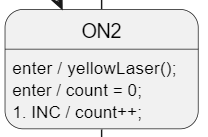

If you accidentally put the `1.` in the wrong place, you will either get a StateSmith error message, or your generated code will have a syntax error:


If you are ever unsure about the syntax, you can always refer to the StateSmith behavior documentation [here](https://github.com/StateSmith/StateSmith/wiki/Behaviors).

### Finish The `ON3` State
Add the following lines to the PlantUML file:

```plantuml
ON3: enter / redLaser();
ON3 --> ON2: DIM
```

Your PlantUML file should now look like this:


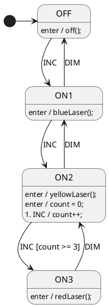

### Generate The Code
Generate the code using `ss.cli` and open `index.html` in a web browser to interact with the state machine. You may need to refresh the page in your browser to see the changes.


<br>
<br>

# Polling A Timeout Transition
Let's assume that the `ON3` state will cause the flashlight to overheat if it stays in that state for too long. We will add a timeout transition that will transition to the `OFF` state if the flashlight stays in the `ON3` state for more than 5 seconds.

We could implement this many ways, but I want to show how you can use "polling" to check guard conditions.

StateSmith state machines are purely event driven. They just sit waiting for you to feed them the next event (no thread, or background CPU usage).

If you need to poll certain conditions, simply send the `DO` event to your state machine at the rate you want. You have full control over how and when the state machine runs.

Any transition without an event specified will use the `DO` event. This is different than UML, but we found the UML way caused problems for most users.


### Add Transition To `OFF` State
A future section will cover how to use the current time to implement a timeout transition. For now, we will simply re-use the `count` variable to implement a timeout transition.

The `index.html` JavaScript is already setup to dispatch the `DO` event to the state machine every 500ms. All we need to do is wait for 10 `DO` events to transition to the `OFF` state. Why 10? 5 seconds x 2 events/second.

Add the following lines to the PlantUML file:

```plantuml
ON3: enter / count = 5 * 2;
ON3: 1. do / count--;
ON3 --> OFF: [count <= 0]
```

We see that the transition from `ON3` to `OFF` is guarded by `[count <= 0]`, but there is no event explicitly associated with it like `DIM` or `INC`.

For convenience, StateSmith will *implicitly* assume the `DO` event for any behavior/transition that does not have an explicit event associated with it.

You can see this if you open the `LightSm.sim.html` file in your browser and look at the `ON3` state. You will see that the transition to `OFF` is guarded by `DO [count <= 0]`.

### Polled State Machines
In case the last section wasn't clear, polled state machines need the `DO` event to be dispatched to them periodically. This enables them to check guard conditions.

If, however, you want a behavior/transition to be checked for any event/trigger, check out StateSmith [TriggerMaps](https://github.com/StateSmith/StateSmith/issues/161).


### Test It
Your design should now look like this:

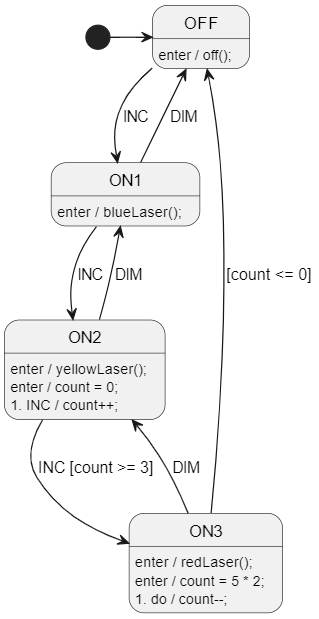

Generate the code using `ss.cli` and open `index.html` in a web browser to interact with the state machine. You may need to refresh the page in your browser to see the changes.


<br>
<br>

# Add A Composite State
Let's finally wire up the `OFF` event.

Instead of having each of the 3 `ON` states transition to `OFF`, we will create a composite state `ON_GROUP` that will contain the `ON1`, `ON2`, and `ON3` states. The `ON_GROUP` state will transition to the `OFF` state when the `OFF` event is received.

### Add The `ON_GROUP` State
Add the `ON_GROUP` state and move the `ON1`, `ON2`, and `ON3` states into it.

```plantuml
state OFF

state ON_GROUP {
    state ON1
    state ON2
    state ON3
}
```

### Add The Transition
Add the transition from `ON_GROUP` to `OFF` when the `OFF` event is received.

```plantuml
ON_GROUP --> OFF: OFF
```

And that's it! Normally handwriting a hierarchical state machine is a lot more work. Easy for us.

### Test It
Your design should now look like this:

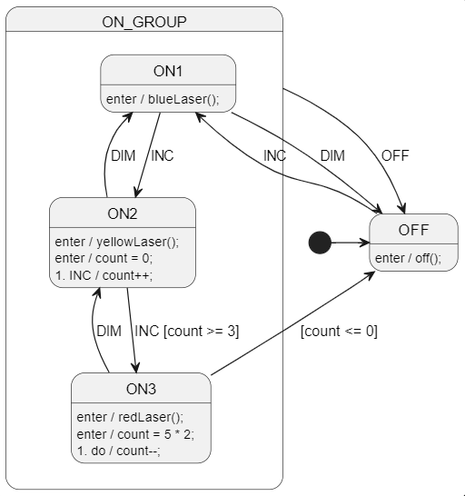

Generate the code using `ss.cli` and open `index.html` in a web browser to interact with the state machine. You may need to refresh the page in your browser to see the changes.

<br>
<br>

# Onwards! ⏭️
Congratulations! You've created a brand new state machine from scratch that controls a laser flashlight.

In the next section, we will discuss options on how to connect your state machine to the outside world.

Head on over to [lesson 3 README.md](../lesson-3/README.md).
