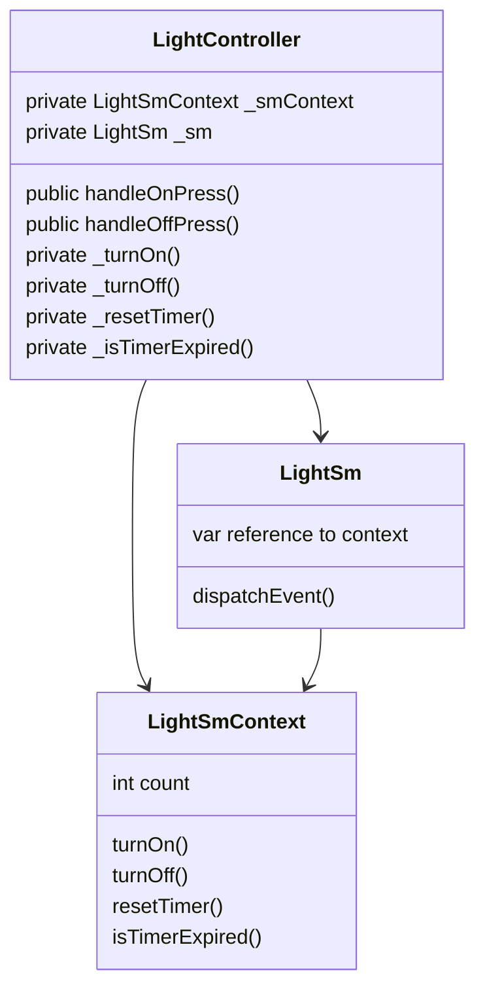

# Connecting Your State Machine to the Outside World
A state machine is often part of a larger system.

So far, our designs have mostly been calling global functions to interact with the outside world. This is a simple way to get started, but it's not the only way to interact with the outside world. In this lesson, we'll look at a few ways to connect your state machine to the outside world.

Each language has various technical options for connecting your state machine to the outside world:
* `C99/C++`: [preprocessor include .inc file](https://github.com/StateSmith/StateSmith-examples/tree/main/c-include-sm-basic-2-plantuml-tutorial) (recommended), composition, globals.
    * `C++` will eventually have its own proper transpiler to support C++ features.
* `C#`: composition, partial class, inheritance, globals.
* `JavaScript`: composition, inheritance, globals.

See [`RenderConfig`](https://github.com/StateSmith/StateSmith/blob/main/docs/settings.md) options for your particular language.

 

# Composition / Interface Object
This pattern is one of the most flexible.

The concept is simple. You use a state machine variable to store a reference to an object that implements a specific interface. The state machine can then call functions on the interface to interact with the outside world.

It doesn't have to an "interface" in the strict sense of the word. It can be a class or a struct with variables and functions.

## Example
In this lesson, we'll look at a simple example of a light controller that uses a composition pattern to interact with a light state machine.

The `LightController` class contains both a state machine context `LightSmContext` and a state machine `LightSm`. The state machine context is a simple class that variables and function pointers.

Before starting the state machine the `LightController` class does the following:
* sets `LightSmContext` function pointers to its own functions
* sets a variable in `LightSm` to reference the `LightSmContext` object

