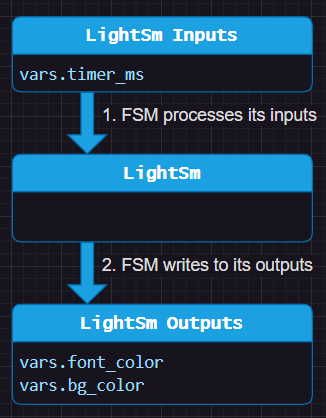
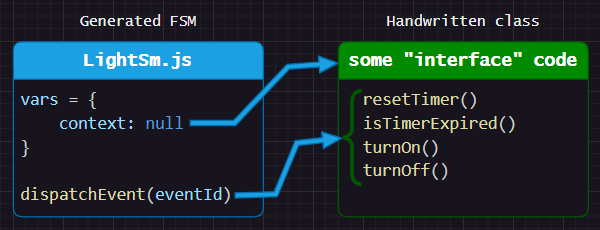

# This Is Optional
This is an architectural lesson. It is more useful if you want to have multiple instances of the same state machine.

If you only have a single instance of a state machine, you can continue to use the global functions approach and skip this lesson.

 

# Connecting Your State Machine to the Outside World
A state machine is often part of a larger system.

So far, our designs have mostly been calling global functions to interact with the outside world. This is a simple way to get started, but it's not the only way to interact with the outside world. In this lesson, we'll look at a few ways to connect your state machine to other code.

Each language has various technical options for connecting your state machine to the outside world:

| Language   | Globals | Vars | Composition | Inheritance | .inc File | Partial Class |
| ---------- |:-------:|:----:|:-----------:|:-----------:|:---------:|:-------------:|
| C99/C++    | ✅      | ✅   | ✅          | -          | ✅        | -            |
| C#         | ✅      | ✅   | ✅          | ✅          | -        | ✅            |
| JavaScript | ✅      | ✅   | ✅          | ✅          | -        | -            |
| Java       | ✅      | ✅   | ✅          | ✅          | -        | -            |
| Python     | ✅      | ✅   | ✅          | ✅          | -        | -            |

> C++ is still using the C99 transpiler. We will support C++ features in the future.

See [`RenderConfig`](https://github.com/StateSmith/StateSmith/blob/main/docs/settings.md) options for your particular language.

 

# Approaches
I recommend starting with the simplest option that works for your project.

You can also mix and match techniques. StateSmith doesn't care. Do what works best for you.

I recommend reading the following sections in order.

 

## Globals
Very simple. This usually works best if you only have a single state machine instance. This is what we've been doing so far.

 

## Variable Based (no functions)
Your state machine doesn't need to call functions or access globals to be useful. It can simply use input and output variables.

See [./variable-based/](./variable-based/README.md) for more details.

 

## `C99/C++` .inc file
If you are using C/C++, check out this [.inc file tutorial](https://github.com/StateSmith/StateSmith-examples/tree/main/c-include-sm-basic-2-plantuml-tutorial).

You can generate a `.inc` file instead of a `.c` file and then include it in your main file.

 

## Composition / Interface
Instead of relying on globals, we can give our state machine a reference to an interface/context object that provides functions/variables to the state machine.

See [./composition/](./composition/README.md) for more details.

<!-- 
When compared to inheritance:

Pros:
- works for any language
- easy to test

Cons:
- a bit more work to wire up
- may require more typing (depends on language) -->

 

## Inheritance
We can connect our state machine to other handwritten code by using inheritance. In the below image `LightSmBase` is handwritten code. It provides functions and variables to the state machine.

See [./inheritance/](./inheritance/README.md) for more details.

<!-- When compared to composition:

Pros:
- often less work wiring stuff up

Cons:
- less flexible
- doesn't abstract/hide state machine details -->

 

## `C#` Partial Class
Similar to inheritance approach.

 
 

# Onwards! ⏭️
The next lesson covers language specific details.

Head on over to [lesson 4 README.md](../lesson-4/README.md).

