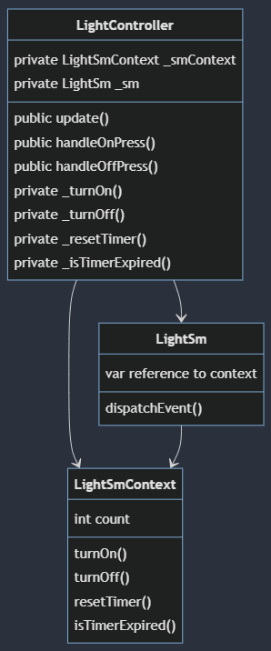
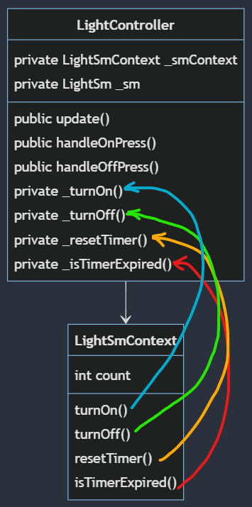
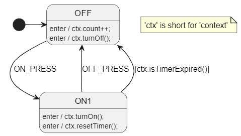
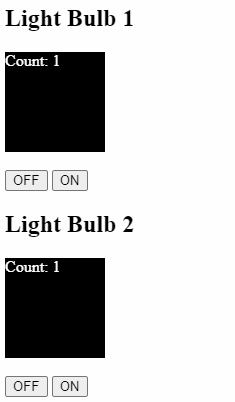

# Composition / Interface Object
This pattern is one of the most flexible.

The concept is simple. You use a state machine variable to store a reference to an object that implements a specific interface. The state machine can then call functions on the interface to interact with the outside world.

It doesn't have to be an "interface" in the strict sense of the word. It can be a class or a struct with variables and functions.

## Example
In this lesson, we'll look at a simple example of a light controller that uses a composition pattern to interact with a light state machine.

The `LightController` class contains both a state machine context `LightSmContext` (which acts like the interface) and a state machine `LightSm`. The state machine context is a simple class with variables and function pointers.

Before starting the state machine, the `LightController` class does the following:
* sets `LightSmContext` function pointers to its own functions
* sets a variable in `LightSm` to reference the `LightSmContext` object



<!--
mermaid diagram link: https://mermaid.live/edit#pako:eNqVk01vgzAMhv8K8mmTaAX0g8Jhl623TZ3UnSakKiOmRIMEJaFqV_HfF6C0W6Galksivw_2G8ccIRYUIYQ4I0o9MbKVJI94xC2zmpj1zLapfhRcS5FlKK1jK9arkGxHNLbIOq8h3Gtro7rjTbRmujKNXH5kLLbKghro7r4npITTDFf8VaJSt_Uk6QOnwhtdSr7it6UkGdRMPtRvLEc5KDPVaMt9wSTSDqkGWnjpz7mDjGsrFiU_9-naY8_YkJv_WLjU3hFpsiUokcdoaWGM_HoyylRBdJwud8h1L-n1UIxGD1e3_JP7ARhf_QRgg7lVThg149nYjkCnmGMEoTlSIj8jiHhluHZslpRpISFMSKbQBlJqsT7wGEItS-yg04h3QWy-eTn9A_VmQ0E4hEfYQzid-uOFN5-5jhf4ge_bcDDB2XhqApPAmXuB4_pBZcOXECalMw5cz1m4rmfUxcSfz5pk743Y1pOi3KYni9U3PJkaKw
 -->

This diagram shows how the function objects/pointers in the `LightSmContext` class are set to the functions in the `LightController` class.



This allows the state machine to effectively call private methods in the `LightController` class. It also has a number of other benefits like making it easier to test the state machine.

## Design
The PlantUML diagram below shows the behavior of the light controller example:

* `OFF` is the initial state and transitions to `ON1` when the on button is pressed.
* `ON1` transitions to `OFF` if the timer expires or the off button is pressed.



Open `index.html` in a browser to see multiple instances of the light controller in action.




## PlantUML Settings
At the bottom of the PlantUML file, you can see the settings that were used to generate the code.

```toml
# This is a TOML comment line

SmRunnerSettings.transpilerId = "JavaScript"

# [RenderConfig] below is a TOML "table"
# It's like a prefix for all the keys below it until the next table
[RenderConfig]
VariableDeclarations = """
    // The `myInterface` var below needs to be manually set to a reference of LightSmContext
    // before running the state machine.
    myInterface: null,
    """

DefaultAnyExpTemplate = "{VarsPath}myInterface.{AutoNameCopy()}"
```

The most interesting part of the above is the `DefaultAnyExpTemplate` setting. You can [read more about it here](https://github.com/StateSmith/StateSmith/blob/main/docs/settings.md#renderconfigdefaultanyexptemplate).

Essentially it translates your state machine action code:
* `resetTimer()` into `this.vars.myInterface.resetTimer()`
* `count++` into `this.vars.myInterface.count++`
* ...

You can see this clearly in the generated LightSm.js file:

```javascript
class LightSm
{
    // snip...

    #OFF_enter()
    {
        // snip...
        
        // OFF behavior
        // uml: enter / { count++; }
        {
            // Step 1: execute action `count++;`
            this.vars.myInterface.count++;
        } // end of behavior for OFF
        
        // OFF behavior
        // uml: enter / { turnOff(); }
        {
            // Step 1: execute action `turnOff();`
            this.vars.myInterface.turnOff();
        } // end of behavior for OFF
    }
}
```

## `DefaultAnyExpTemplate` Affects Every Identifier
For example, if you had the text `output_press = true;` in your state machine, it would be expanded to `this.vars.myInterface.output_press = this.vars.myInterface.true;`.

See [issue 363](https://github.com/StateSmith/StateSmith/issues/363) for workaround and plans for improvement.

## Alternative to `DefaultAnyExpTemplate`
Instead of using `DefaultAnyExpTemplate`, you can explicitly use a context variable in your diagram. You can name it whatever you want `i`, `iface`, `c`, `ctx`...

See the [composition-2](../composition-2/README.md) example for more details.


## Implementation Details
See .js files for implementation details.

## Composition / Interface Object Tips
* You don't have to use a separate class for the interface. You could give the state machine a reference to the `LightController` class itself. This saves on a class definition.
