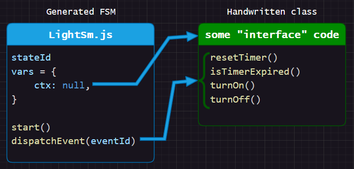
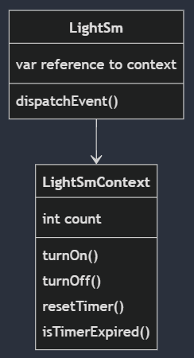
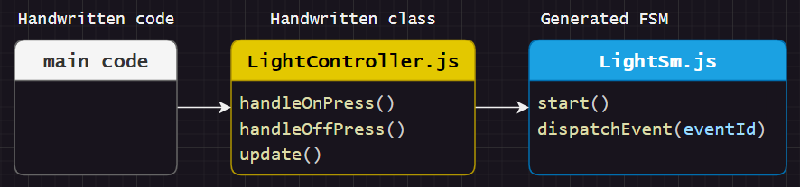
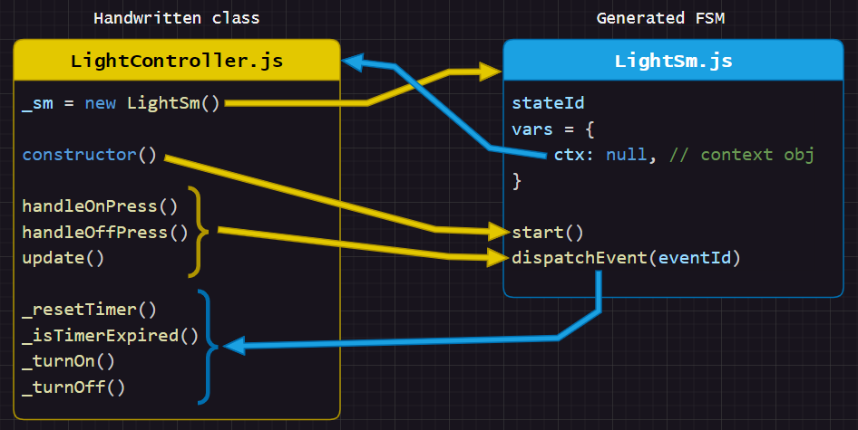
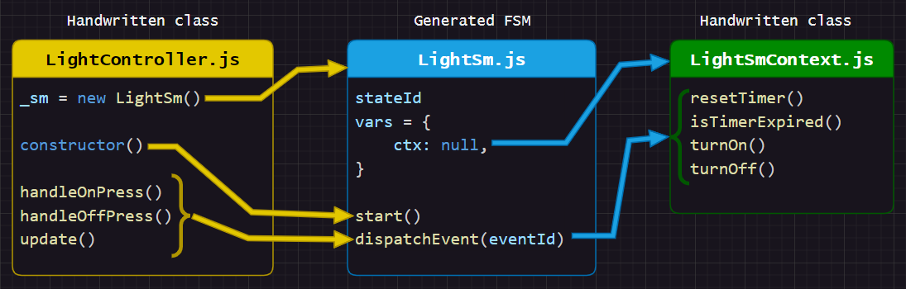

# Composition / Interface Object
This pattern is very simple and also flexible.

Instead of relying on globals, we give our state machine a reference to an interface/context object that provides functions/variables to the state machine.

This makes it easy to have multiple state machine instances and has other benefits like easier testing.

In the below image, `ctx` ("context") is a user declared state machine variable that points an interface/context object. The state machine can call functions like `ctx.turnOff()`.



<!--  -->

<!-- https://mermaid.live/edit#pako:eNptkT9vwyAQxb8KuqmVnMgEnDoMXdpsrTqkU-UFmXOMGoOFz1HSyN-91I0T9Q8L3O_gvQecoPQGQUG50133aPU26KZwhWNxjIw92W1Nm-bBO8IDsdN3jzHriJW-dzQB6oN7cTe3P-qquoKAHdKrbTBcme1GsD60NqCZ-PBvhKv3XoeoVmFAVyIjH4OM6aa-sV2rqazXe3T0R3SSm83uf90OEohhGm1NfJLRrQCqscECVFwaHd4LKNwQ9-me_OboSlAUekwg-H5bg6r0rotV3xpNeH7PC221e_O-mY7EEtQJDqCkTOfZQkrO5UpkMuMigSMoLu7mIhWRCJllaZ4PCXyMAul8ueBilebLuzxfpXzBJ8-1seTDxRLH8vn8yV_T8Am4B5uI -->

<br>

## Example State Machine
The behavior of the state machine is as follows:

* `OFF` is the initial state and transitions to `ON1` when the on button is pressed.
* `ON1` transitions to `OFF` if the timer expires or the off button is pressed.


If you don't like having to type `ctx.` in front of everything, you have a few options:
- use a shorter variable name like `c`
- use [`RenderConfig.DefaultAnyExpTemplate`](https://github.com/StateSmith/StateSmith/blob/main/docs/settings.md#renderconfigdefaultanyexptemplate) and be aware of its current [limitations/quirks](https://github.com/StateSmith/StateSmith/issues/363).
- use `.csx` files and [StateSmith expansions](https://github.com/StateSmith/tutorial-2/tree/main/lesson-3).
- use `inheritance` and a language like `C#`/`Java` that don't need `this.`/`self.` to access class members.

<br>

## StateSmith Settings
Here are the settings that were used to generate the code:

```toml
SmRunnerSettings.transpilerId = "JavaScript"
SmRunnerSettings.simulation.enableGeneration = false  # just to show it off
RenderConfig.AutoExpandedVars = """
    /**
     * The context object that provides functions and variables to this state machine.
     * This state machine variable must be set before starting the state machine.
     * @type {LightSmContext}
     */
    ctx: null, 
    """
```
> The `@type` JSDoc tag is optional but can be useful for IDEs like vscode. StateSmith doesn't care about it.


<br>


## Interactive Demo
Open `index.html` in a browser to see multiple instances of the light controller in action.


<br>


# 📢Too Many Options! 📢
There are many ways to use composition/interfaces to connect your state machine to the outside world.

The capabilities of the programming language also come into play.

The only important thing is that you pick a pattern that works well for you (and your team).

What follows is one possible example implementation.

<br>
<br>


# Implementation Details
In this example, we have a handwritten `LightController` class that the main code base interacts with. The main codebase doesn't interact directly with the generated state machine `LightSm`. It definitely could, but sometimes it is better to have an abstraction in between. This is especially true if you want to do some processing before dispatching an event to the state machine, or logging, or error handling, etc.




<br>


## Basic Wiring (few files)
Let's start small.

We have a simple handwritten `LightController` class that provides 2 things:
1. it provides an abstraction between the main code base and the state machine
2. it provides functions that the state machine needs to call

```javascript
class LightController
{
    // Our state machine instance. Private to this class.
    #sm = new LightSm();

    constructor() {
        // Give the state machine a reference to this class.
        // This MUST be done before starting the state machine.
        this.#sm.vars.ctx = this;

        // start the state machine
        this.#sm.start();
    }

    // Called by the state machine when the light should be turned on.
    // Technically a public function, but only the state machine should call it.
    // Leading underscore to discourage main code base from calling it.
    _turnOn() {
        this._lightHtmlObject.style.backgroundColor = "yellow";
        this._lightHtmlObject.style.color = "black"; // text color
        this._lightHtmlObject.textContent = "Count: " + this._smContext.count;
    }

    //...
}
```

> You could technically put the `_turnOn()` function code into the StateSmith design, but it could lead to "noisy" diagrams and also make it harder to refactor your code later on.
>
> With practice, you'll find the sweet spot of how much code and detail to put into the state machine. Too little detail and the state machine diagram won't contain enough important detail (forcing readers to flip constantly between the diagram and code).


<br>


From a pure architecture perspective, the above code is not ideal. The `LightController` depends on the state machine `LightSm` and vice versa. As pictured below.

In practice and in small/contained projects, this situation is often good enough. It also has the benefit of being quick and easy to implement. The diagram below is more confusing than the actual code.





We can improve the architecture and involve another class, but sometimes we don't want/need the additional overhead of more classes and files.

One downside to the simple pattern above is that functions like `_resetTimer()` need to be public so that the state machine can call it. Those functions being public may not be desirable though as they can also be seen by the main code base that interacts with `LightController`. That's why they are named with a leading underscore.


<br>


## Hiding Functions We Want Private
The actual implementation for this example does add another class `LightSmContext`. This allows the `LightController` to have full control over its public API.



<!--  -->

<!--
mermaid diagram link: https://mermaid.live/edit#pako:eNqVk01vgzAMhv8K8mmTaAX0g8Jhl623TZ3UnSakKiOmRIMEJaFqV_HfF6C0W6Galksivw_2G8ccIRYUIYQ4I0o9MbKVJI94xC2zmpj1zLapfhRcS5FlKK1jK9arkGxHNLbIOq8h3Gtro7rjTbRmujKNXH5kLLbKghro7r4npITTDFf8VaJSt_Uk6QOnwhtdSr7it6UkGdRMPtRvLEc5KDPVaMt9wSTSDqkGWnjpz7mDjGsrFiU_9-naY8_YkJv_WLjU3hFpsiUokcdoaWGM_HoyylRBdJwud8h1L-n1UIxGD1e3_JP7ARhf_QRgg7lVThg149nYjkCnmGMEoTlSIj8jiHhluHZslpRpISFMSKbQBlJqsT7wGEItS-yg04h3QWy-eTn9A_VmQ0E4hEfYQzid-uOFN5-5jhf4ge_bcDDB2XhqApPAmXuB4_pBZcOXECalMw5cz1m4rmfUxcSfz5pk743Y1pOi3KYni9U3PJkaKw
 -->

<!-- 

This allows the state machine to effectively call private methods in the `LightController` class. It also has a number of other benefits like making it easier to test the state machine. -->


<br>


## Implementation Details
See .js files for implementation details.

