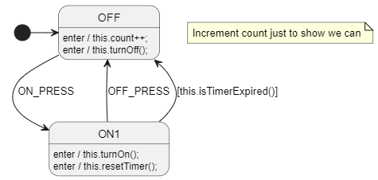

# Inheritance 2
Very slight variation on the earlier inheritance example.

The only difference is that we avoid using the `DefaultAnyExpTemplate` setting and explicitly use `this.` instead.

This is a bit more verbose, but allows us to also access global variables/functions/keywords normally without them being picked up by `DefaultAnyExpTemplate`.
