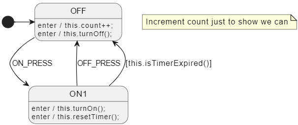
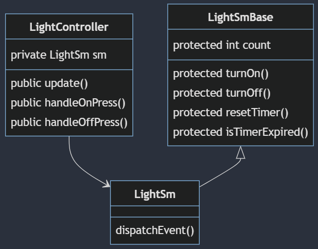

# Inheritance Pattern
This example uses the same state machine design as the composition example but implemented this time using inheritance.

Inheritance is a bit more ergonomic in languages like `C#` and `Java` where you don't need to use `this.` or `self.` to access class members.



If you don't like having to type `this.` in front of everything, you have a few options:
- use `.csx` files and [StateSmith expansions](https://github.com/StateSmith/tutorial-2/tree/main/lesson-3).
- use [`RenderConfig.DefaultAnyExpTemplate`](https://github.com/StateSmith/StateSmith/blob/main/docs/settings.md#renderconfigdefaultanyexptemplate) and be aware of its current [limitations/quirks](https://github.com/StateSmith/StateSmith/issues/363).


## Class Diagram
In this example, we have a `LightController` class that contains an instance of the `LightSm` state machine. The `LightController` class is responsible for managing and running the state machine. You don't need to do this, but it can be useful sometimes.



<!-- 
mermaid design
https://mermaid.live/edit#pako:eNp9klFPgzAQx79Kc0-asKXAYIMYH9S9aWaiT4aXSo_RCC1py7I5992twKYzaF_a3O9_1_9du4dccYQU8ooZcyfYWrM6k5kkbnUxci_WpX2qyb4PEsKFaZjNy-UGpb247MOH0aQbZvA7kZBGK4u5RU6EtCRXrbRj0LZaruSx9AgrinGo0aB9FjXqcS5MB5fbRmjk_3m_VdJqVVWoz_2LDbN4mok5zaqj7WslctI23GnODPSgZJJXuJKPzqb5mxfFmeDk7revyeT6aOSHYBj61cdkck7BA9d6zQR3z931lIEtscYMUnfkTL9lkMmD0_UdLLmwSkNasMqgB6y16mknc0itbvEoGr7MSYVd0sPwqb42DxomId3DFlI_9qehHyU-DeIwoWESe7BzYT-ehkkQR5TOAzqL5gcP3pVyVel0HsyjgC4WIV2E4SyMunIvHex9aNWuy-H-wydE9uEf
 -->


## StateSmith Settings
Here are the TOML settings that were used to generate the code.

```toml
SmRunnerSettings.transpilerId = "JavaScript"
RenderConfig.JavaScript.ExtendsSuperClass = "LightSmBase"
```


## Implementation Details
See .js files for implementation details.

## Tips
* Depending upon your target language, you may be able to inject class code into the generated state machine class. I would use this sparingly, but it can be useful if you want to do something unique.
* We also have a C#/Java idea to make it easier to combine the base class and abstraction (controller) class in one class.
    * https://github.com/StateSmith/StateSmith/issues/356
