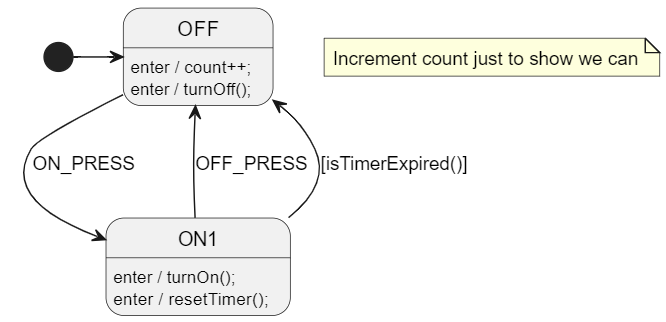
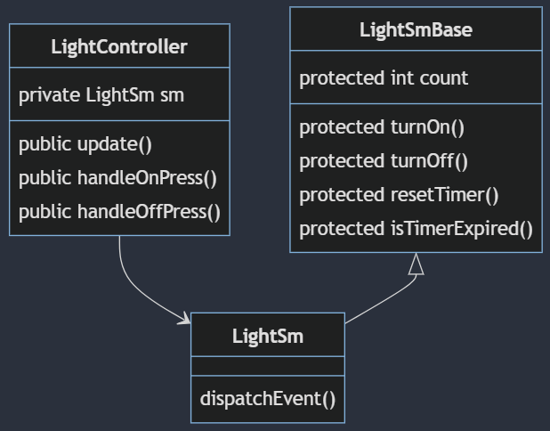
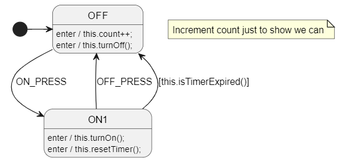

# Inheritance Pattern
This example uses the same state machine design as the composition example but implemented this time using inheritance.



## Class Diagram
<!-- 
mermaid design
https://mermaid.live/edit#pako:eNp9klFPgzAQx79Kc0-asKXAYIMYH9S9aWaiT4aXSo_RCC1py7I5992twKYzaF_a3O9_1_9du4dccYQU8ooZcyfYWrM6k5kkbnUxci_WpX2qyb4PEsKFaZjNy-UGpb247MOH0aQbZvA7kZBGK4u5RU6EtCRXrbRj0LZaruSx9AgrinGo0aB9FjXqcS5MB5fbRmjk_3m_VdJqVVWoz_2LDbN4mok5zaqj7WslctI23GnODPSgZJJXuJKPzqb5mxfFmeDk7revyeT6aOSHYBj61cdkck7BA9d6zQR3z931lIEtscYMUnfkTL9lkMmD0_UdLLmwSkNasMqgB6y16mknc0itbvEoGr7MSYVd0sPwqb42DxomId3DFlI_9qehHyU-DeIwoWESe7BzYT-ehkkQR5TOAzqL5gcP3pVyVel0HsyjgC4WIV2E4SyMunIvHex9aNWuy-H-wydE9uEf

 -->

 
 
## PlantUML Settings
At the bottom of the PlantUML file, you can see the TOML settings that were used to generate the code.

```toml
SmRunnerSettings.transpilerId = "JavaScript"
RenderConfig.JavaScript.ExtendsSuperClass = "LightSmBase"
RenderConfig.DefaultAnyExpTemplate = "this.{AutoNameCopy()}" # not needed for C#
```

The most interesting part of the above is the `DefaultAnyExpTemplate` setting. You can [read more about it here](https://github.com/StateSmith/StateSmith/blob/main/docs/settings.md#renderconfigdefaultanyexptemplate).

Essentially it translates your state machine action code:
* `resetTimer()` into `this.resetTimer()`
* `count++` into `this.count++`
* ...

📢**NOTE!!!** The `DefaultAnyExpTemplate` setting is not needed for C# as `resetTimer()` is already equivalent to `this.resetTimer()`.

You can see this clearly in the generated LightSm.js file:

```javascript
class LightSm extends LightSmBase
{
    // snip...

    #OFF_enter()
    {
        // snip...
        
        // OFF behavior
        // uml: enter / { count++; }
        {
            // Step 1: execute action `count++;`
            this.count++;
        } // end of behavior for OFF
        
        // OFF behavior
        // uml: enter / { turnOff(); }
        {
            // Step 1: execute action `turnOff();`
            this.turnOff();
        } // end of behavior for OFF
    }
}
```

## `DefaultAnyExpTemplate` Affects Every Identifier
For example, if you had the text `output_press = true;` in your state machine, it would be expanded to `this.output_press = this.true;`.

See [issue 363](https://github.com/StateSmith/StateSmith/issues/363) for workaround and plans for improvement.

## Alternative to `DefaultAnyExpTemplate`
Instead of using `DefaultAnyExpTemplate`, you can explicitly just use `this.` like `this.count++` in your state machine code.

See the [inheritance-2](../inheritance-2/README.md) example for more details.



This is a bit more verbose, but allows us to also access global variables/functions/keywords normally without them being picked up by `DefaultAnyExpTemplate`.


## Implementation Details
See .js files for implementation details.

## Tips
* Depending upon your target language, you may be able to inject class code into the generated state machine class. I would use this sparingly, but it can be useful if you want to do something unique.
* C# idea to make it easier to combine the base class and abstraction (controller) class in one class.
    * https://github.com/StateSmith/StateSmith/issues/356


