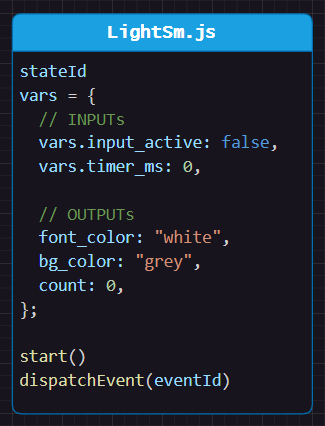
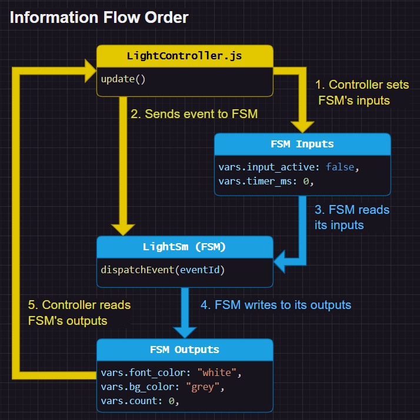

# Design
This example is equivalent to the others in this lesson, but looks a bit different because it is also polling the switch instead of using button events.

Turn on the switch to see the light turn on. The light will turn off after 3 seconds.


# Variable Based (no functions)
Your state machine doesn't need to call functions or access globals to be useful.

In this example, the state machine only uses input and output variables:




You use this state machines like this (pseudo code):
```js
// LightController.js
function updateStateMachine(sm) {
    // set inputs to the state machine
    sm.vars.input_active = getSwitchState();
    sm.vars.timer_ms += loopTimeMs;

    // run the state machine
    sm.dispatchEvent(LightSm.EventId.DO);

    // use state machine outputs
    setBackgroundColor(sm.vars.bg_color);
    setFontColor(sm.vars.font_color);
    //...
}
```




<br>


# Interactive Example
Open `index.html` in your browser and use the different switches.


# Tips
You can name the variables however you want. You could prefix with `input_` or `output_` to make it clear what the variable is used for. Or you can use `in`/`out` objects to group them together.

