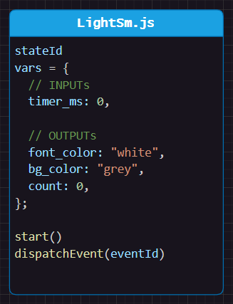

# Variable Based (no functions)
Your state machine doesn't need to call functions or access globals to be useful.

In this example, the state machine only uses input and output variables:



You use this state machines like this (pseudo code):
```js
// pseudo code that runs the state machine `sm` every loop
function updateStateMachine(sm) {
    // set inputs to the state machine
    sm.vars.timer_ms += loopTimeMs;

    // run the state machine
    sm.dispatchEvent(LightSm.EventId.DO);

    // use state machine outputs
    setBackgroundColor(sm.vars.bg_color);
    setFontColor(sm.vars.font_color);
    //...
}
```

In this example, there is another class `LightController` that has an instance of the state machine `LightSm`. The `LightController` class is responsible for setting the input variables and using the output variables.


<br>


# Design
This example is equivalent to the composition and inheritance examples in this lesson.

Turn on the switch to see the light turn on. The light will turn off after 3 seconds or if you turn off the switch.


# Interactive Example
Open `index.html` in your browser and use the different switches.


# Tips
You can name the variables however you want. You could prefix with `input_` or `output_` to make it clear what the variable is used for. Or you can use `in`/`out` objects to group them together.

