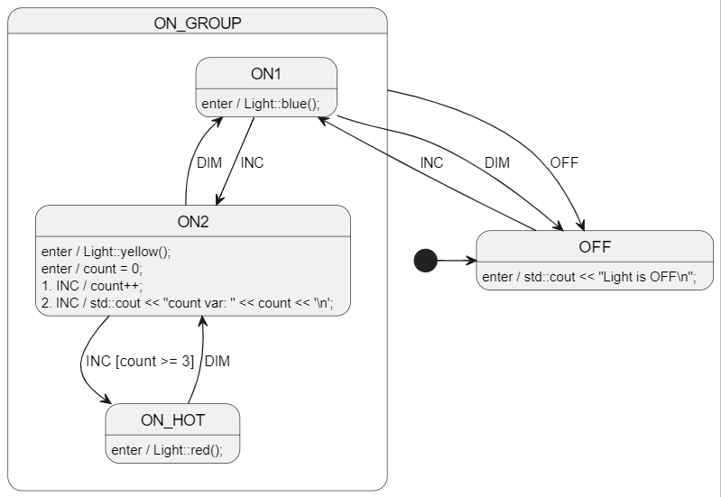

# C++ Welcome!
> See [cpp2-gcc](../cpp2-gcc/README.md) for a more modern C++ way of using StateSmith.
> 
> This is the old way of using StateSmith with C++. It generates C style C++ code.
> You might want to use this style if you don't have a C++11 or greater compiler. <br>


This example uses gcc for convenience, but you can use any C++ compiler you like.

The only GCC specific things are:
- the tiny build shell script `build_run.sh`


<br>

# Diagram
See [LightSm.plantuml](./LightSm.plantuml) for the PlantUML code.




<br>

# Run The Code Gen
Run in this directory:
```
ss.cli run -h
```


<br>

# Run The Example Project
Run in this directory:
```
./build_run.sh
```


<br>

# More examples
https://github.com/StateSmith/StateSmith-examples
* Highly recommend checking out tutorial on [how to use `.inc` files](https://github.com/StateSmith/StateSmith-examples/blob/main/c-include-sm-basic-2-plantuml-tutorial/README.md)


