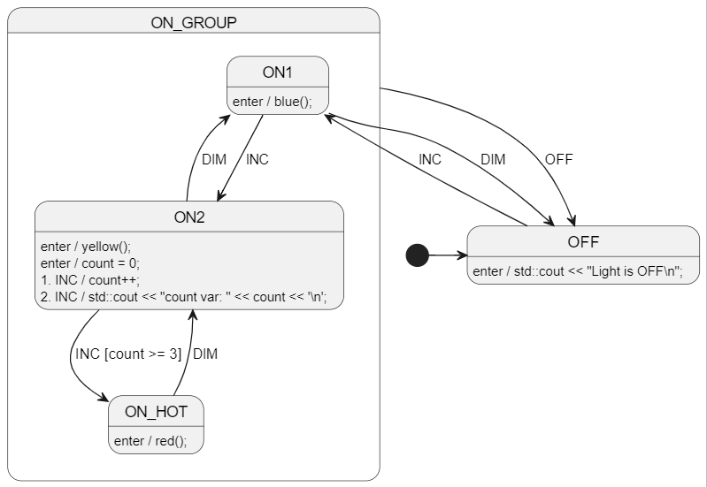

# C++11 Welcome!
📢 Idiomatic C++11 support was added in CLI version 0.16.0 (lib version 0.17.0).

This example uses gcc for convenience, but you can use any C++11 compiler you like.

The only GCC specific things are:
- the tiny build shell script `build_run.sh`


<br>

# Diagram
See [LightSm.plantuml](./LightSm.plantuml) for the PlantUML code.




<br>

# Run The Code Gen
Run in this directory:
```
ss.cli run -h
```


<br>

# Run The Example Project
Run in this directory:
```
./build_run.sh
```


<br>

# More examples
* [cpp-inheritance-1](./cpp-inheritance-1/README.md) - Shows easy state machine testing. Uses a base class. `ss.cli` `plantuml`.
* [cpp-inheritance-2](./cpp-inheritance-2/README.md) - Shows easy state machine testing. Uses custom `ClassCode`. `ss.cli` `plantuml`.

https://github.com/StateSmith/StateSmith-examples


