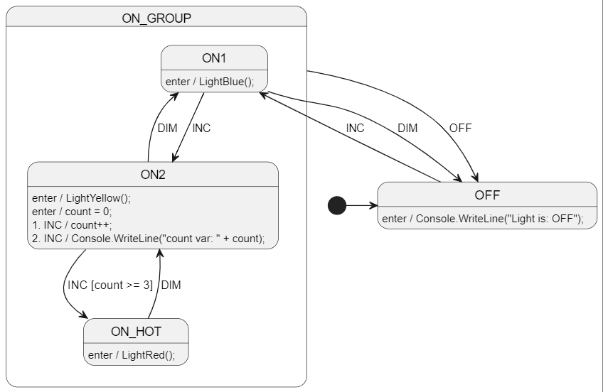

# C# - Welcome!
Full disclosure, I'm an embedded C developer that really enjoys C#. I think the C# language has a ton to offer and absolutely love the open source Roslyn compiler. That's why I wrote StateSmith in C#.

If you like StateSmith and want to help improve it, your help would be very much appreciated!

https://github.com/StateSmith/StateSmith/wiki/Contributing

<br>


# Diagram
See [LightSm.plantuml](./LightSm.plantuml) for the PlantUML code.




<br>

# Run The Code Gen
Run in this directory:
```
ss.cli run -h
```


<br>

# Run The Example Project
Use `dotnet run` or use an IDE (Visual Studio, Rider, ...)


<br>

# More examples
See https://github.com/StateSmith/StateSmith-examples
