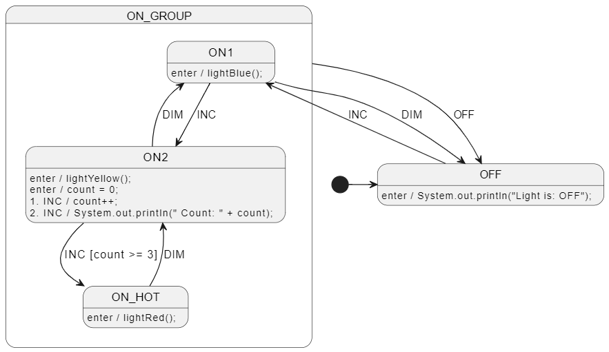

# Java - Welcome!
📢 Java support was added in CLI version 0.13.0 (lib version 0.14.0).


<br>

# Diagram
See [LightSm.plantuml](./my_light_package/LightSm.plantuml) for the PlantUML code.




<br>

# Run The Code Gen
Run in this directory (`r` for recursive):
```
ss.cli run -hr
```


<br>

# Compile and Run
Use the following commands to compile and run the program:

```bash
javac Program.java
java Program
```


<br>

# More examples
See https://github.com/StateSmith/StateSmith-examples
