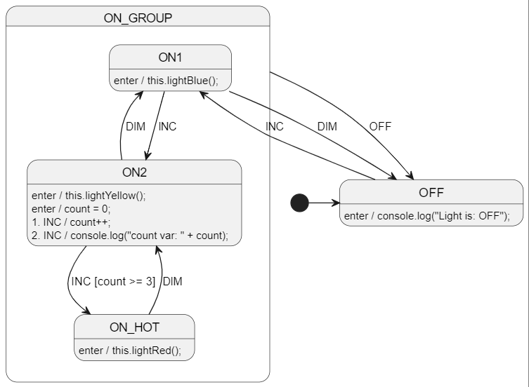

# nodejs - Welcome!
All the other JavaScript examples are web-based, so this one is a nodejs example.


<br>

# Diagram
See [LightSm.plantuml](./LightSm.plantuml) for the PlantUML code.




<br>

# Run StateSmith code gen
Run in this directory:
```
ss.cli run -h
```

<br>

# Retrieve required packages
Use npm to restore the required packages for handwritten user code. 

**NOTE:** the generated StateSmith code does not require **any** packages.

```bash
npm install
```

<br>

# Run nodejs program
```bash
node index.js
```


<br>

# More examples
See https://github.com/StateSmith/StateSmith-examples
