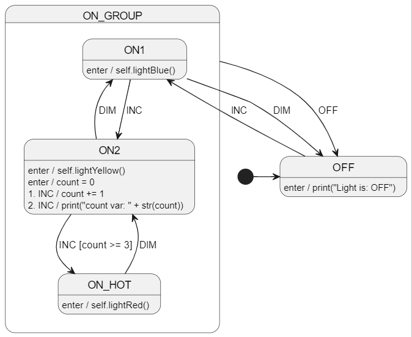

# Python - Welcome!
📢 Python support was added in CLI version 0.14.0 (lib version 0.15.0).

# Diagram
See [LightSm.plantuml](./LightSm.plantuml) for the PlantUML code.



# Run The Code Gen
Run in this directory:
```
ss.cli run -h
```

# Compile and Run
Use the following command to compile and run the program:

```bash
python Program.py
```

# More examples
See https://github.com/StateSmith/StateSmith-examples
