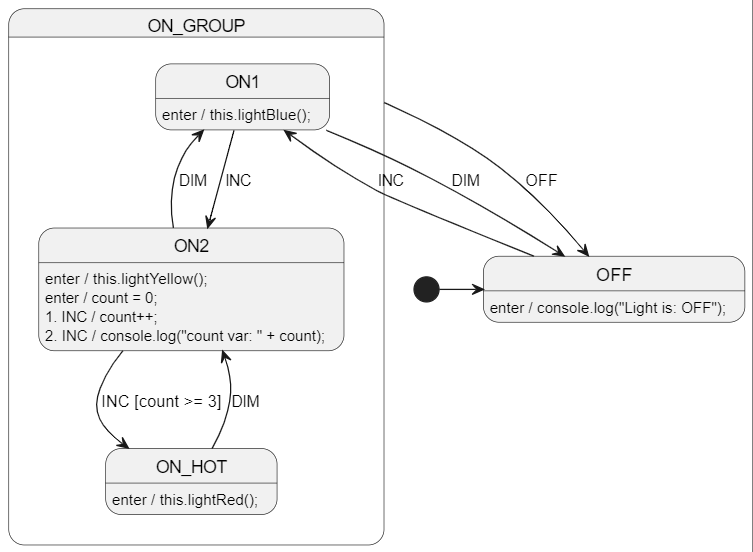

# TypeScript (nodejs) Welcome!
All the other TypeScript/JavaScript examples are web-based, so this one is a nodejs example.

📢 TypeScript support was added in CLI version 0.15.0 (lib version 0.16.0).


<br>

# Diagram
See [LightSm.plantuml](./LightSm.plantuml) for the PlantUML code.




<br>

# Run StateSmith code gen
Run in this directory:
```
ss.cli run -h
```

<br>

# Retrieve required packages
Use npm to restore the required packages for handwritten user code. 

**NOTE:** the generated StateSmith code does not require **any** packages.

```bash
npm install
```

<br>

# Compile TypeScript to JavaScript
Run the below command in this directory:
```bash
tsc
```

<br>

# Run nodejs program
```bash
node out/index.js
```


<br>

# More examples
See https://github.com/StateSmith/StateSmith-examples
